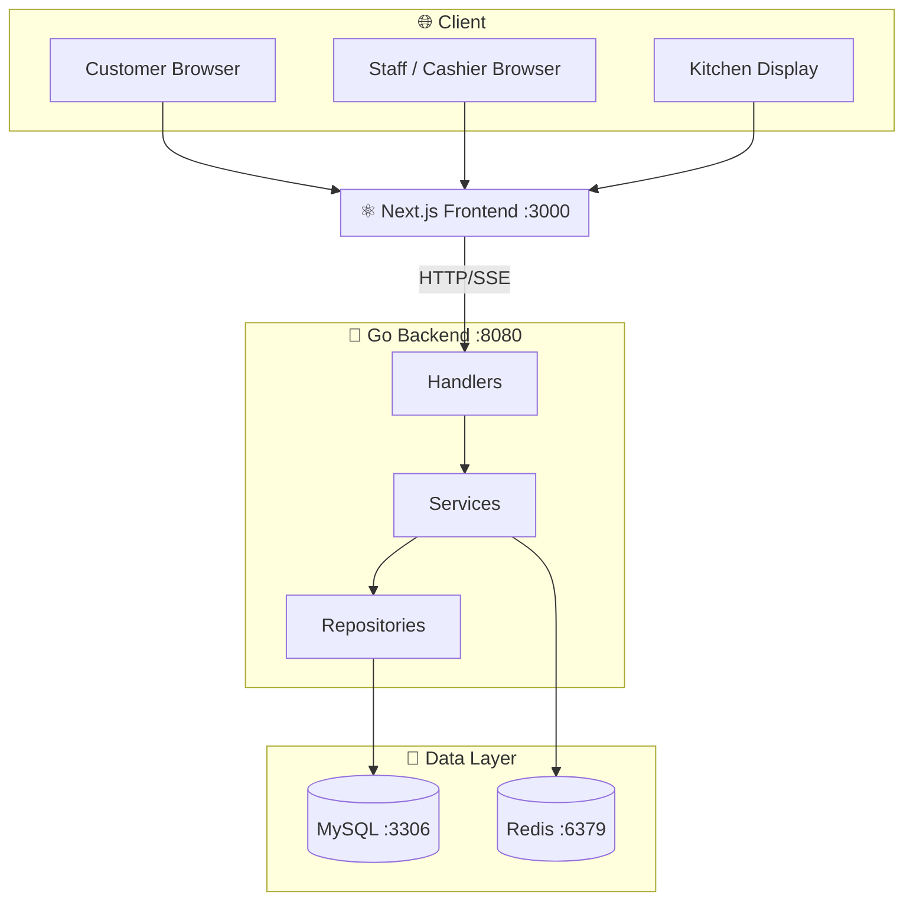
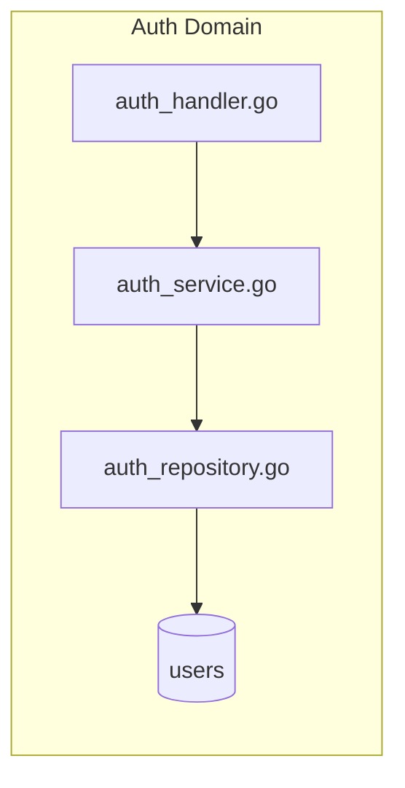
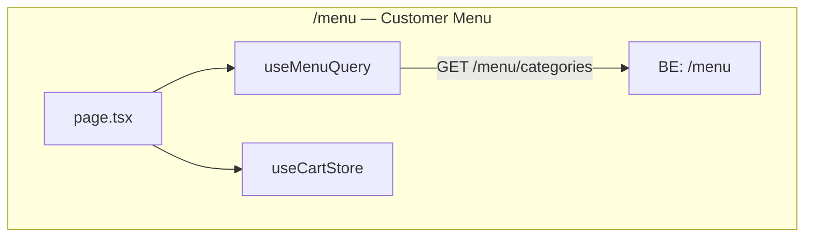
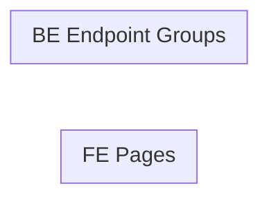
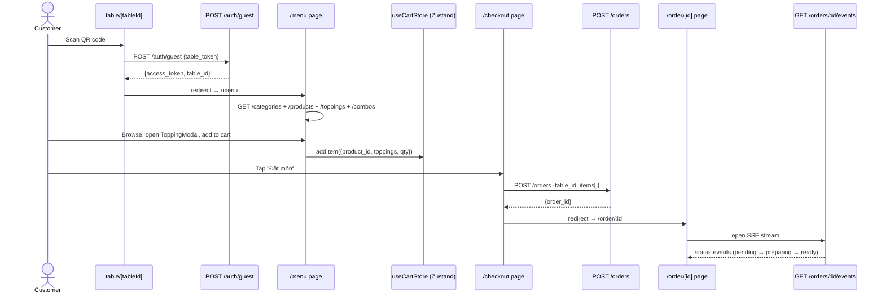
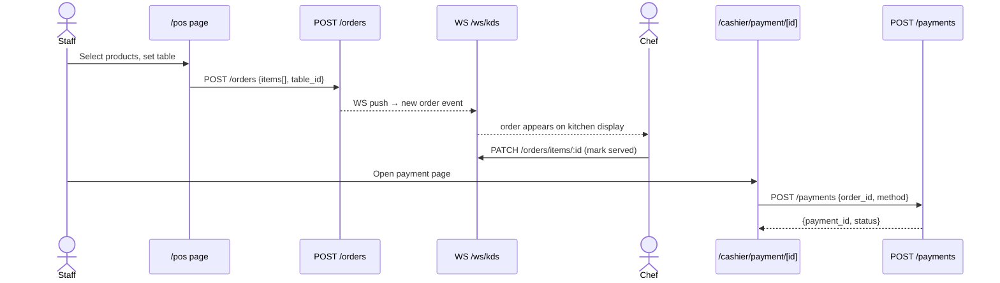
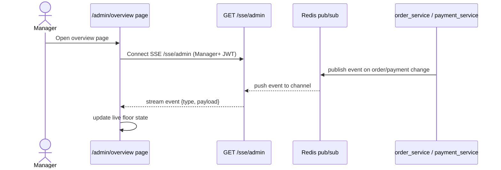

You are generating a Mermaid knowledge graph of the BanhCuon restaurant codebase.
Argument (which view to draw, default "arch"): $ARGUMENTS

Supported views: `arch` · `be` · `fe` · `api` · `flow` · `all`
Special mode: `refresh` — re-scan only changed domains, then patch only the affected output file.
If no argument → use `arch`.

Output files (one per layer — do NOT mix them):
- `docs/graphs/CODEBASE_GRAPH_BE.md`     ← `be` view only
- `docs/graphs/CODEBASE_GRAPH_FE.md`     ← `fe` view only
- `docs/graphs/CODEBASE_GRAPH.md`        ← `arch` + `api` + `flow` (cross-cutting)
- `all` view → writes all three files

Execute every phase below in order. Read before you draw — do not guess file names or connections.

---

## Phase 0 — Mode Detection (run first, always)

Parse `$ARGUMENTS`:

- If argument is `refresh` → set `REFRESH_MODE=true`. Do NOT run a full scan. Follow the Refresh Path below instead of Phases 1–3.
- If argument is a valid view (`arch`, `be`, `fe`, `api`, `flow`, `all`) → set `REFRESH_MODE=false`, proceed to Phase 1.
- If argument is empty or unrecognised → set view to `arch`, `REFRESH_MODE=false`, proceed to Phase 1.

### Refresh Path (only when `REFRESH_MODE=true`)

**Step R1 — Detect changed files:**
```bash
git diff HEAD --name-only
```
If the repo is clean (no diff), also run:
```bash
git diff HEAD~1 --name-only
```

**Step R2 — Map files to target file + subgraph:**

| File pattern | Target file | Subgraph(s) to redraw |
|---|---|---|
| `be/internal/handler/product_handler.go` | `CODEBASE_GRAPH_BE.md` | products domain |
| `be/internal/handler/order_handler.go` | `CODEBASE_GRAPH_BE.md` | orders + groups domain |
| `be/internal/handler/auth_handler.go` | `CODEBASE_GRAPH_BE.md` | auth domain |
| `be/internal/handler/payment_handler.go` | `CODEBASE_GRAPH_BE.md` | payment domain |
| `be/internal/handler/staff_handler.go` | `CODEBASE_GRAPH_BE.md` | staff domain |
| `be/internal/handler/analytics_handler.go` | `CODEBASE_GRAPH_BE.md` | analytics domain |
| `be/internal/handler/ingredient_handler.go` | `CODEBASE_GRAPH_BE.md` | ingredients domain |
| `be/internal/handler/table_handler.go` | `CODEBASE_GRAPH_BE.md` | infra domain |
| `be/internal/repository/**` | `CODEBASE_GRAPH_BE.md` | domain matching the repo file name |
| `be/cmd/server/main.go` | `CODEBASE_GRAPH.md` | api + arch views (routes changed) |
| `fe/src/app/(shop)/menu/**` | `CODEBASE_GRAPH_FE.md` | menu subgraph |
| `fe/src/app/(shop)/checkout/**` | `CODEBASE_GRAPH_FE.md` | checkout subgraph |
| `fe/src/app/(shop)/order/**` | `CODEBASE_GRAPH_FE.md` | order-tracking subgraph |
| `fe/src/app/(dashboard)/kds/**` | `CODEBASE_GRAPH_FE.md` | kds subgraph |
| `fe/src/app/(dashboard)/pos/**` | `CODEBASE_GRAPH_FE.md` | pos subgraph |
| `fe/src/app/(dashboard)/admin/**` | `CODEBASE_GRAPH_FE.md` | admin subgraph |
| `fe/src/store/**` | `CODEBASE_GRAPH_FE.md` | all FE subgraphs (store fields) |
| `fe/src/hooks/**` | `CODEBASE_GRAPH_FE.md` | subgraph(s) that use the changed hook |

Build two lists: `CHANGED_BE` (subgraphs in BE file) and `CHANGED_FE` (subgraphs in FE file) and `CHANGED_SHARED` (sections in shared file).

If no files match any pattern above (e.g. only docs changed) → print:
```
No code changes detected. Graph is already up to date.
```
and stop.

**Step R3 — Re-scan only changed domains:**
- For each domain in `CHANGED_BE`: grep only the relevant handler + repo file. Do not scan other domains.
- For each domain in `CHANGED_FE`: find only the relevant page + hook files. Do not scan other pages.
- For `CHANGED_SHARED`: re-read `be/cmd/server/main.go` routes section only.

**Step R4 — Patch only the affected file(s):**

For each target file that has changes:
- Read only that file (e.g. read `CODEBASE_GRAPH_BE.md`, not the FE or shared file)
- Replace only the changed subgraph block(s) — identified by their `subgraph domain_name [...]` header
- Leave all other subgraphs in that file untouched
- Update the `Last generated` timestamp at the top of the file
- Write the patched file back

Do NOT read or write files whose domains did not change.

**Step R5 — Print a diff summary:**
```
Refresh complete
  CODEBASE_GRAPH_BE.md  → [N subgraphs updated] / [unchanged domains: N]
  CODEBASE_GRAPH_FE.md  → [N subgraphs updated] / [unchanged domains: N]
  CODEBASE_GRAPH.md     → [updated / unchanged]
```

Stop here. Do not proceed to Phase 1.

---

---

## Phase 1 — Scan the Codebase

Run these in parallel to collect raw facts:

**Backend:**
- `find be/internal/handler -name "*.go" | sort` → list all handler files
- `find be/internal/service -name "*.go" | sort` → list all service files
- `find be/internal/repository -name "*.go" | sort` → list all repository files
- `find be/migrations -name "*.sql" | sort` → list all DB tables (infer from file names)

**Frontend:**
- `find fe/src/app -name "page.tsx" | sort` → list all FE pages
- `find fe/src/hooks -name "*.ts" -o -name "*.tsx" | sort` → list all shared hooks
- `find fe/src/store -name "*.ts" | sort` → list all Zustand stores
- `find fe/src/components -maxdepth 2 -name "*.tsx" | sort` → list shared components

**Connections:**
- `grep -r "fetch\|api-client\|apiClient\|useMutation\|useQuery" fe/src/app --include="*.tsx" -l` → which pages make API calls
- `grep -r "import.*service\|NewService\|service\." be/internal/handler --include="*.go" -l` → handler→service wiring
- `grep -r "import.*repository\|NewRepo\|repo\." be/internal/service --include="*.go" -l` → service→repo wiring

From this, build a mental model:
- Domain list (e.g. auth, products, orders, payment, staff, menu, kds, pos, admin)
- Which handler → which service → which repository (per domain)
- Which FE page → which hook → which store → which API endpoint

---

## Phase 2 — Read Key Files for Detail

Read these files (in parallel) to fill in the domain connections:

- `docs/contract/API_CONTRACT_v1.2.md` lines 1–80 → extract endpoint groups by domain
- `fe/src/lib/api-client.ts` lines 1–60 → confirm base URL pattern
- `be/internal/handler/router.go` or `be/cmd/main.go` → confirm route groupings (read whichever exists)

From API_CONTRACT, map each endpoint group to a FE page that consumes it.

---

## Phase 3 — Draw the Requested View(s)

Use only facts gathered in Phase 1 and 2. Do not invent nodes or edges.

### View: `arch` — Full System Architecture



Fill in the FE page group nodes from Phase 1 scan results.
Add a `subgraph` per BE domain (auth, products, orders, payment, staff, admin).

---

### View: `be` — Backend Layer Graph

Draw one subgraph per domain. Each domain shows:
`HandlerFile → ServiceFile → RepositoryFile → DB table(s)`

Use actual file names (without path prefix) as node labels.



---

### View: `fe` — Frontend Page Graph

Draw one subgraph per FE route group. Each shows:
`page.tsx → useXxxQuery hook → Zustand store (if any) → API endpoint`



---

### View: `api` — FE ↔ BE API Connection Map

Draw a bipartite graph: FE pages on the left, BE endpoint groups on the right.
Draw an edge for each real API call found in Phase 1 grep.



---

### View: `flow` — User Journey Sequence Diagrams

Draw one `sequenceDiagram` per major user journey. Use actual endpoint paths and component/file names found in Phase 1. Do not invent steps.

**Journey 1 — Customer: QR Scan → Order → Tracking**



**Journey 2 — Staff: POS Order → Cashier Payment**



**Journey 3 — Admin: Live Floor Monitor (SSE)**



---

### View: `all`

Draw all five views above, one after another, each under its own `### arch`, `### be`, `### fe`, `### api`, `### flow` heading.

---

## Phase 4 — Write Output

1. Run `mkdir -p docs/graphs` if the directory does not exist.

2. Write diagrams to the correct file based on which view was drawn:

| View drawn | Write to | Header |
|---|---|---|
| `be` | `docs/graphs/CODEBASE_GRAPH_BE.md` | `# BE Layer Graph` |
| `fe` | `docs/graphs/CODEBASE_GRAPH_FE.md` | `# FE Page Graph` |
| `arch` | `docs/graphs/CODEBASE_GRAPH.md` | `# Codebase Architecture` |
| `api` | `docs/graphs/CODEBASE_GRAPH.md` | append `## API Map` section |
| `flow` | `docs/graphs/CODEBASE_GRAPH.md` | append `## Flow Diagrams` section |
| `all` | all three files — `BE.md`, `FE.md`, `GRAPH.md` (one write each) |

Use this structure for every file written:

```markdown
# [Header from table above]

> Auto-generated by /codebase-graph. Re-run to refresh.
> Last generated: [today's date]

## [View Name]

[mermaid block]
```

When writing `all`: write `CODEBASE_GRAPH_BE.md` (be view), `CODEBASE_GRAPH_FE.md` (fe view), and `CODEBASE_GRAPH.md` (arch + api + flow sections) as three separate file writes.

3. After writing, print:

```
Graph written:
  docs/graphs/CODEBASE_GRAPH_BE.md   (be view)       ← only if be or all
  docs/graphs/CODEBASE_GRAPH_FE.md   (fe view)       ← only if fe or all
  docs/graphs/CODEBASE_GRAPH.md      (arch/api/flow) ← only if arch, api, flow, or all

Open with: VSCode Markdown Preview (Cmd+Shift+V) or push to GitHub.

Nodes found:
  BE domains     : [N]
  FE pages       : [N]
  API edges      : [N]
  Flow journeys  : [N]  (only when flow or all)
```

---

## Rules

- Use real file names and real endpoint paths — no invented nodes.
- If a domain has no repository (e.g. pure service logic), omit the repo node.
- If a FE page has no hook file yet (stub page), show it as a node with a `?` label.
- Keep node labels short: filename without path, endpoint without base URL.
- Do NOT add explanatory prose inside the Mermaid blocks — labels only.
