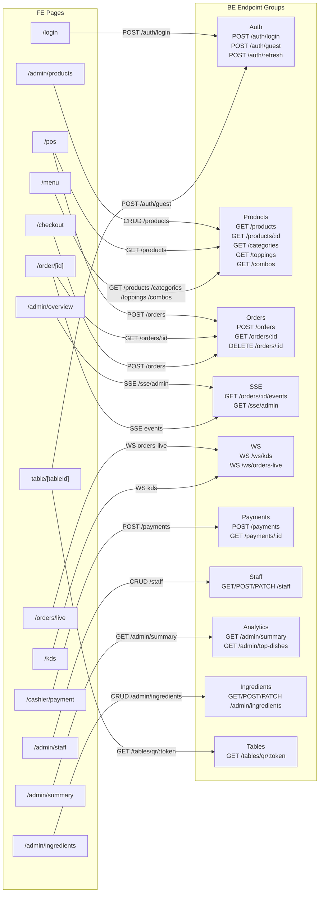

# Codebase Architecture

> Auto-generated by /codebase-graph. Re-run to refresh.
> Last generated: 2026-05-28
>
> Layer-specific graphs:
> - BE layer → `CODEBASE_GRAPH_BE.md`
> - FE layer → `CODEBASE_GRAPH_FE.md`

---

## arch — Full System Architecture

```mermaid
graph TD
    subgraph Client ["🌐 Client"]
        C1[Customer Browser - QR Scan]
        C2[Staff / Cashier Browser]
        C3[Kitchen Display Browser]
    end

    subgraph FE ["⚛️ Next.js Frontend :3000"]
        subgraph Shop ["(shop) — Customer"]
            S1["table/[tableId] — QR landing"]
            S2["/menu — Browse + Cart"]
            S3["/checkout — Place order"]
            S4["/order/[id] — Track order"]
            S5["/menu/product/[id]"]
            S6["/menu/combo/[id]"]
        end
        subgraph Dashboard ["(dashboard) — Staff"]
            D1["/kds — Kitchen Display WS"]
            D2["/pos — Point of Sale"]
            D3["/cashier/payment/[id]"]
            D4["/orders/live — Live feed WS"]
            D5["/admin/* — Admin (8 pages)"]
        end
        AUTH["/login — Auth"]
    end

    subgraph BE ["🐹 Go Backend :8080"]
        subgraph auth_d ["Auth"]
            AH[auth_handler.go]
        end
        subgraph products_d ["Products / Menu"]
            PH[product_handler.go]
        end
        subgraph orders_d ["Orders / Groups"]
            OH[order_handler.go]
            GH[group_handler.go]
        end
        subgraph payment_d ["Payment"]
            PAH[payment_handler.go]
        end
        subgraph staff_d ["Staff"]
            SH[staff_handler.go]
        end
        subgraph admin_d ["Admin / Analytics"]
            ANH[analytics_handler.go]
            IH[ingredient_handler.go]
        end
        subgraph infra_d ["Infra"]
            FH[file_handler.go]
            TH[table_handler.go]
        end
        subgraph realtime_d ["Realtime"]
            SSE[SSE /orders/:id/events\n/sse/admin\n/orders/group/:id/events]
            WS[WS /ws/kds\n/ws/orders-live]
        end
    end

    subgraph Data ["💾 Data Layer"]
        DB[(MySQL :3306\nusers · products · categories\ntoppings · combos · orders\norder_items · payments · tables\nfiles · order_groups · ingredients)]
        RD[(Redis Stack :6379\nSSE pub/sub · WS hub)]
    end

    C1 -->|QR scan| S1
    C2 --> Dashboard
    C3 --> D1

    S1 -->|POST /auth/guest| AH
    S2 -->|GET /products /categories /toppings /combos| PH
    S3 -->|POST /orders| OH
    S4 -->|GET /orders/:id + SSE| OH
    S4 -->|SSE stream| SSE
    S5 -->|GET /products/:id| PH
    S6 -->|GET /combos/:id| PH
    AUTH -->|POST /auth/login| AH

    D1 -->|WS /ws/kds| WS
    D2 -->|GET /products + POST /orders| PH
    D2 -->|POST /orders| OH
    D3 -->|POST /payments + GET /payments/:id| PAH
    D4 -->|WS /ws/orders-live| WS
    D5 -->|GET/POST/PATCH /admin/*| ANH
    D5 -->|CRUD /staff| SH
    D5 -->|CRUD /products /categories| PH

    AH --> DB
    PH --> DB
    OH --> DB
    OH --> RD
    PAH --> DB
    SH --> DB
    ANH --> DB
    IH --> DB
    TH --> DB
    FH --> DB
    SSE --> RD
    WS --> RD
```

---

## api — FE ↔ BE API Connection Map

