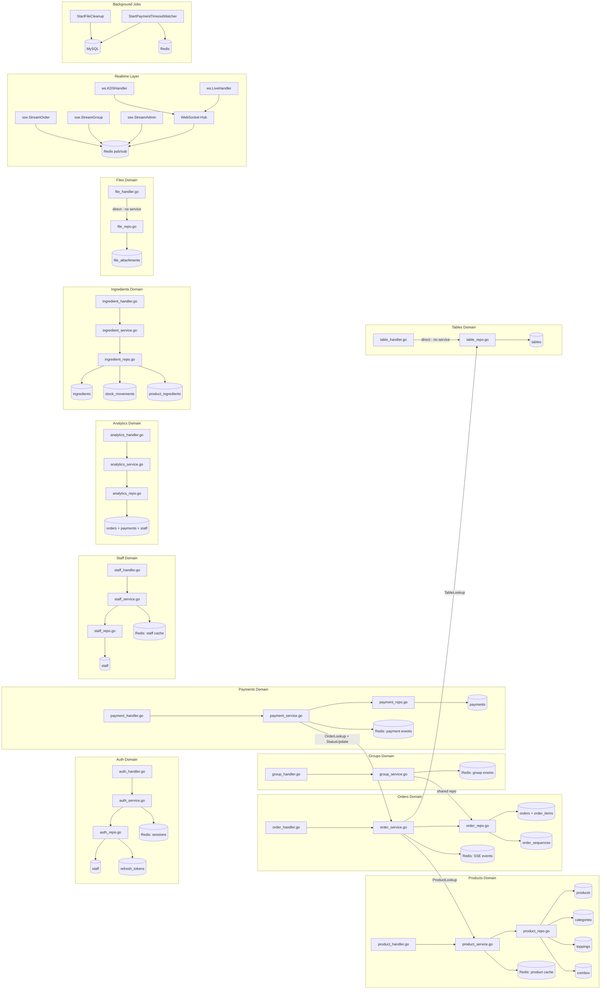

# BE Layer Graph

> Auto-generated by /codebase-graph. Re-run to refresh.
> Last generated: 2026-05-28

## be — Backend Layer Graph

## Domain Summary

| Domain | Handler | Service | Repository | DB Tables | Redis |
|---|---|---|---|---|---|
| Auth | auth_handler.go | auth_service.go | auth_repo.go | staff, refresh_tokens | sessions |
| Products | product_handler.go | product_service.go | product_repo.go | products, categories, toppings, combos | product cache |
| Orders | order_handler.go | order_service.go | order_repo.go | orders, order_items, order_sequences | SSE events |
| Groups | group_handler.go | group_service.go | order_repo.go (shared) | orders.group_id — no separate table | group events |
| Payments | payment_handler.go | payment_service.go | payment_repo.go | payments | payment events |
| Tables | table_handler.go | — direct | table_repo.go | tables | — |
| Staff | staff_handler.go | staff_service.go | staff_repo.go | staff | staff cache |
| Analytics | analytics_handler.go | analytics_service.go | analytics_repo.go | orders + payments + staff (read-only) | — |
| Ingredients | ingredient_handler.go | ingredient_service.go | ingredient_repo.go | ingredients, stock_movements, product_ingredients | — |
| Files | file_handler.go | — direct | file_repo.go | file_attachments | — |

## Route Groups

| Route Prefix | Handler | Auth Level |
|---|---|---|
| POST /api/v1/auth/login | auth_handler | public |
| POST /api/v1/auth/guest | auth_handler | public |
| POST /api/v1/auth/refresh | auth_handler | public |
| GET /api/v1/products | product_handler | public |
| POST/PATCH /api/v1/products | product_handler | manager+ |
| GET /api/v1/categories, /toppings, /combos | product_handler | public |
| POST/PATCH/DELETE /api/v1/categories, /toppings, /combos | product_handler | manager+ / admin |
| * /api/v1/orders | order_handler + group_handler | JWT required |
| POST /api/v1/payments | payment_handler | cashier+ |
| POST /api/v1/payments/webhook/* | payment_handler | public (HMAC verified) |
| * /api/v1/tables | table_handler | cashier+ / manager+ |
| * /api/v1/staff | staff_handler | manager+ |
| * /api/v1/admin/summary, /top-dishes, /staff-performance | analytics_handler | manager+ |
| * /api/v1/admin/ingredients | ingredient_handler | manager+ |
| POST /api/v1/files/upload | file_handler | cashier+ |
| GET /api/v1/sse/admin | sse.StreamAdmin | manager+ |
| GET /api/v1/ws/kds | ws.KDSHandler | public (JWT inside WS) |
| GET /api/v1/ws/orders-live | ws.LiveHandler | public (JWT inside WS) |
