# FE Page Graph

> Auto-generated by /codebase-graph. Re-run to refresh.
> Last generated: 2026-05-28

## FE View

```mermaid
graph TD

    subgraph auth_grp ["/login - Staff Auth"]
        login_p[login/page.tsx]
        login_api[auth.api.ts]
        login_store[useAuthStore]
        login_p --> login_api
        login_api -->|POST /auth/login| login_store
    end

    subgraph qr_grp ["/table/:tableId - QR Guest Entry"]
        qr_p[table/page.tsx]
        qr_auth[useAuthStore]
        qr_cart[useCartStore]
        qr_p -->|POST /auth/guest| qr_auth
        qr_p --> qr_cart
    end

    subgraph menu_grp ["/menu - Customer Menu"]
        menu_p[menu/page.tsx]
        prod_detail[product/:id/page.tsx]
        combo_detail[combo/:id/page.tsx]
        menu_cart[useCartStore]
        menu_settings[useSettingsStore]
        menu_cat_be[BE: GET /categories]
        menu_prod_be[BE: GET /products]
        menu_combo_be[BE: GET /combos]
        menu_p --> menu_cart
        menu_p --> menu_settings
        menu_p -->|useQuery| menu_cat_be
        menu_p -->|useQuery| menu_prod_be
        menu_p -->|useQuery| menu_combo_be
        prod_detail -->|useQuery| menu_prod_be
        combo_detail -->|useQuery| menu_combo_be
    end

    subgraph checkout_grp ["/checkout - Order Placement"]
        checkout_p[checkout/page.tsx]
        checkout_cart[useCartStore]
        checkout_be[BE: POST /orders]
        checkout_p --> checkout_cart
        checkout_p -->|useMutation RHF+Zod| checkout_be
    end

    subgraph order_grp ["/order/:id - Order Tracking"]
        order_p[order/page.tsx]
        order_sse_hook[useOrderSSE]
        order_cart[useCartStore]
        order_sse_be[BE: SSE /orders/:id/events]
        order_cancel_be[BE: DELETE /orders/:id]
        order_item_be[BE: DELETE /orders/items/:id]
        order_p --> order_sse_hook
        order_p --> order_cart
        order_sse_hook -->|SSE stream + reconnect| order_sse_be
        order_p -->|useMutation| order_cancel_be
        order_p -->|useMutation| order_item_be
    end

    subgraph kds_grp ["/kds - Kitchen Display"]
        kds_p[kds/page.tsx]
        kds_orders_be[BE: GET /orders]
        kds_ws_be[BE: WS /ws/kds]
        kds_patch_be[BE: PATCH /orders/items/:id]
        kds_p -->|useQuery| kds_orders_be
        kds_p -->|WebSocket| kds_ws_be
        kds_p -->|useMutation| kds_patch_be
    end

    subgraph pos_grp ["/pos - Point of Sale"]
        pos_p[pos/page.tsx]
        pos_auth[useAuthStore]
        pos_cat_be[BE: GET /categories]
        pos_prod_be[BE: GET /products]
        pos_order_be[BE: POST /orders]
        pos_ws_be[BE: WS /ws/kds]
        pos_p --> pos_auth
        pos_p -->|useQuery| pos_cat_be
        pos_p -->|useQuery| pos_prod_be
        pos_p -->|useMutation| pos_order_be
        pos_p -->|WebSocket| pos_ws_be
    end

    subgraph cashier_grp ["/cashier/payment/:id - Cashier Payment"]
        cashier_p[cashier/payment/page.tsx]
        cashier_auth[useAuthStore]
        cashier_order_be[BE: GET /orders/:id]
        cashier_pay_be[BE: POST /payments]
        cashier_ws_be[BE: WS /ws/kds]
        cashier_p --> cashier_auth
        cashier_p -->|useQuery| cashier_order_be
        cashier_p -->|useMutation| cashier_pay_be
        cashier_p -->|WebSocket| cashier_ws_be
    end

    subgraph overview_grp ["/admin/overview - Live Floor Monitor"]
        overview_p[overview/page.tsx]
        overview_sse_hook[useAdminSSE]
        overview_ws_hook[useOverviewWS]
        overview_admin_api[admin.api.ts]
        overview_sse_be[BE: SSE /sse/admin]
        overview_ws_be[BE: WS /ws/kds]
        overview_rest_be[BE: GET /orders and /tables]
        overview_p --> overview_sse_hook
        overview_p --> overview_ws_hook
        overview_p --> overview_admin_api
        overview_sse_hook -->|SSE stream| overview_sse_be
        overview_ws_hook -->|WebSocket| overview_ws_be
        overview_admin_api -->|REST| overview_rest_be
    end

    subgraph admin_grp ["/admin/* - Admin CRUD"]
        admin_products[products/page.tsx]
        admin_categories[categories/page.tsx]
        admin_toppings[toppings/page.tsx]
        admin_combos[combos/page.tsx]
        admin_staff[staff/page.tsx]
        admin_ingredients[ingredients/page.tsx]
        admin_marketing[marketing/page.tsx]
        admin_summary[summary/page.tsx]
        admin_api_mod[admin.api.ts]
        admin_be[BE: /products /categories /toppings /combos /staff /ingredients /qr-codes /analytics]
        admin_products --> admin_api_mod
        admin_categories --> admin_api_mod
        admin_toppings --> admin_api_mod
        admin_combos --> admin_api_mod
        admin_staff --> admin_api_mod
        admin_ingredients --> admin_api_mod
        admin_marketing --> admin_api_mod
        admin_summary --> admin_api_mod
        admin_api_mod -->|CRUD| admin_be
    end
```

### Stores

| Store | File | Used By |
|---|---|---|
| `useAuthStore` | `features/auth/auth.store.ts` | login, qr-entry, kds, pos, cashier, overview |
| `useCartStore` | `store/cart.ts` | menu, checkout, order-tracking, qr-entry |
| `useSettingsStore` | `store/settings.ts` | menu |
| `useFavouritesStore` | `store/favourites.ts` | menu |
| `summary.store.ts` | `features/admin/summary.store.ts` | admin/summary |

### Shared Hooks

| Hook | File | Transport | Endpoint |
|---|---|---|---|
| `useOrderSSE` | `hooks/useOrderSSE.ts` | SSE + auto-reconnect (5 attempts) | `GET /orders/:id/events` |
| `useAdminSSE` | `hooks/useAdminSSE.ts` | SSE | `GET /sse/admin` |
| `useOverviewWS` | `hooks/useOverviewWS.ts` | WebSocket | `WS /ws/kds` |

### Shared Components

| Group | Components |
|---|---|
| `components/menu/` | `ProductCard`, `ComboCard`, `CartDrawer`, `CategoryTabs`, `ToppingModal`, `ComboModal` |
| `components/order/` | `OrderDetailSheet` |
| `components/shared/` | `ConnectionErrorBanner`, `EmptyState`, `StatusBadge`, `CookieConsent` |
| `components/guards/` | `AuthGuard`, `RoleGuard` |
| `components/ui/` | `Button`, `Input`, `Card`, `Badge`, `Label` |
