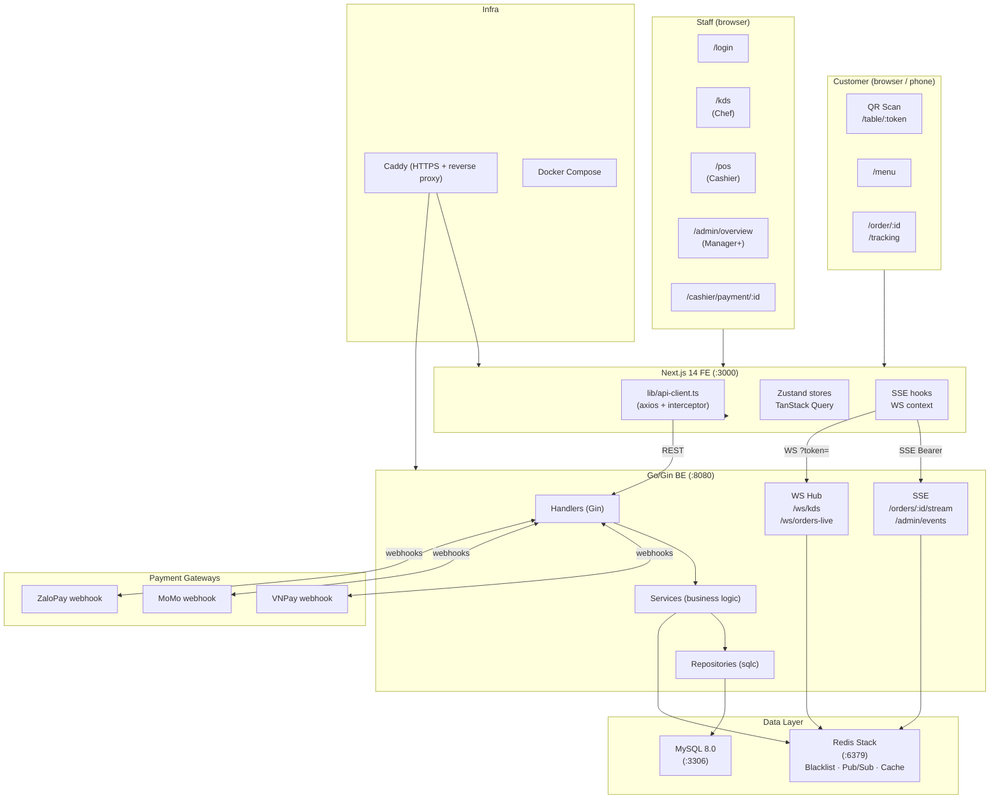

# System Overview — Hệ Thống Quản Lý Quán Bánh Cuốn

> **TL;DR:** A full-stack restaurant management platform for a bánh cuốn shop. Three user types —
> customers (QR scan, no login), kitchen staff (KDS), and cashier/manager (POS + overview). Orders
> flow from QR scan → kitchen display → cashier payment, with realtime updates via WebSocket and
> SSE throughout. Built on Go/Gin backend + Next.js 14 frontend.

---

## 1. What the System Does

Digitises the entire order lifecycle for a dine-in bánh cuốn restaurant:

| Problem (manual) | Solution |
|---|---|
| Orders written on paper, errors at handoff | Digital order submitted from customer's phone |
| Kitchen doesn't know order priority | KDS (fullscreen kitchen display) with colour-coded urgency |
| Cashier manually totals bills | POS auto-calculates; payment via VNPay / MoMo / ZaloPay / cash |
| No real-time order tracking for customers | SSE-based live progress view on customer's phone |
| No sales data or staff management | Admin dashboard: revenue reports, staff CRUD, QR marketing |

---

## 2. The Three User Types

| Type | Entry Point | Role | Key Screens |
|---|---|---|---|
| **Customer** | Scan QR code at table | `customer` (guest JWT, no login) | `/menu` → `/order/:id` → `/tracking` |
| **Staff** (chef) | `/login` → `/kds` | `chef` | Kitchen Display System |
| **Staff** (cashier) | `/login` → `/pos` | `cashier` | POS, `/cashier/payment/:id` |
| **Staff** (manager/admin) | `/login` → `/admin/overview` | `manager` / `admin` | Floor view, order confirm, reports |

> Customer is completely isolated from the staff role hierarchy. A guest never sees a login page.

---

## 3. Feature List by Area

### 3.1 Customer (QR Path)
- Scan table QR → instant guest JWT (no account creation)
- Browse menu: products, combos, toppings
- Cart → `TableConfirmModal` (no name/phone) → order submitted
- Live order tracking via SSE (item-by-item progress)
- Cancel items/order (< 30% served rule)
- Add more items to an active order

### 3.2 Kitchen Display System (KDS)
- Fullscreen order board: colour-coded by urgency (pending / preparing / done)
- WebSocket real-time: new orders appear instantly with audio beep
- Chef marks items done → `qty_served` increments → auto-transitions order to "ready"
- Manual status change: `confirmed → preparing → ready`

### 3.3 POS + Payment
- Cashier builds walk-in orders (source: `pos`)
- WS notifies when kitchen marks order "ready" → auto-redirect to payment
- Payment methods: COD (cash, instant), VNPay QR, MoMo QR, ZaloPay QR
- Optional: upload payment proof screenshot
- Browser print receipt after payment completion

### 3.4 Admin / Manager
- Live floor view: table grid + active order per table
- Confirm new orders (pending → confirmed) via popup
- Force-cancel any order (< 30% rule still applies)
- Staff CRUD: create accounts, assign roles, activate/deactivate
- QR code generation per table (marketing)
- Admin dashboard: revenue stats, product analytics

### 3.5 System-wide
- RBAC: 6 roles (customer, chef, cashier, staff, manager, admin)
- JWT auth: staff (24 h access + 30 d refresh cookie); guest (2 h, stateless)
- One active order per table enforced server-side
- Payment webhooks from VNPay / MoMo / ZaloPay with HMAC verification
- File upload with orphan-cleanup job (6 h interval)

---

## 4. High-Level Architecture

---

## 5. Key Screens Per Role

| Role | Screen | URL | Purpose |
|---|---|---|---|
| Customer | Menu | `/menu` | Browse + add to cart |
| Customer | Order detail | `/order/:id` | Live item progress via SSE |
| Customer | Tracking | `/tracking` | Full live table/queue view |
| Chef | KDS | `/kds` | Kitchen order board |
| Cashier | POS | `/pos` | Walk-in order creation |
| Cashier | Payment | `/cashier/payment/:id` | Bill + payment method select |
| Manager+ | Overview | `/admin/overview` | Floor view + order confirm |
| Manager+ | Staff admin | `/admin/staff` | Staff CRUD |
| Manager+ | Marketing | `/admin/marketing` | QR code generation |

---

## Deep Dive Sources

| Topic | File |
|---|---|
| Full business rules | `docs/core/MASTER_v1.2.md` |
| All API endpoints | `docs/contract/API_CONTRACT_v1.2.md` |
| Per-flow details | `docs/work_flow/FLOW_INDEX.md` |
| BE code patterns | `docs/be/BE_SYSTEM_GUIDE.md` |
| FE code patterns | `docs/fe/FE_SYSTEM_GUIDE.md` |
| DB schema | `docs/be/be_code_summary/DB_SCHEMA_SUMMARY.md` |
| Original BRD | `docs/requirements/BanhCuon_BRD_v1.md` |
