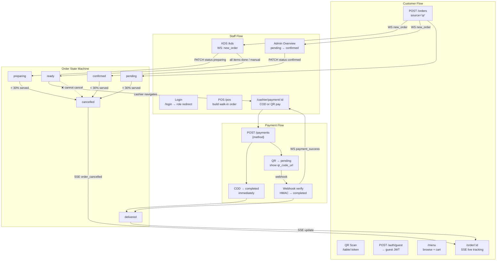

# Flow Index — System Handbook

> **TL;DR:** Five major flows: customer QR journey, staff operations (KDS + POS), order state
> machine, payment, and cancellation. All flows share one order lifecycle and intersect at the
> realtime layer (WS/SSE). Start here, then open the specific flow file.

---

## Flow Documents in This Folder

| # | File | What It Covers |
|---|---|---|
| 1 | [CLIENT_FLOW.md](CLIENT_FLOW.md) | QR scan → menu → cart → order → live tracking |
| 2 | [STAFF_FLOW.md](STAFF_FLOW.md) | Login → KDS / POS / Overview → bill → payment confirm |
| 3 | [ORDER_STATE_MACHINE.md](ORDER_STATE_MACHINE.md) | All order status transitions + cancellation rules |
| 4 | [PAYMENT_FLOW.md](PAYMENT_FLOW.md) | COD + VNPay / MoMo / ZaloPay webhook flows |
| — | [../02_spec/BUSINESS_RULES.md](../02_spec/BUSINESS_RULES.md) | RBAC, cancel rule, JWT rules, realtime config |

---

## Authoritative Source Flows (original docs)

| # | File | What It Covers |
|---|---|---|
| 01 | `docs/work_flow/FLOW_01_ENTRY_POINTS.md` | QR scan + staff login → role-based redirect |
| 02 | `docs/work_flow/CLIENT_QR_FLOW.md` | Full QR → order → tracking (single source of truth) |
| 03 | `docs/work_flow/FLOW_03_STAFF_KDS.md` | Chef: WS events, mark items done, status bumps |
| 04 | `docs/work_flow/FLOW_04_STAFF_POS.md` | Cashier: walk-in order, wait for kitchen |
| 05 | `docs/work_flow/FLOW_05_ADMIN_OVERVIEW.md` | Manager: floor view, confirm orders |
| 06 | `docs/work_flow/FLOW_06_PAYMENT.md` | COD + QR payment, proof upload |
| 07 | `docs/work_flow/FLOW_07_CANCEL.md` | Cancel rule (< 30%), who cancels what |
| 08 | `docs/work_flow/FLOW_08_ORDER_STATE_MACHINE.md` | All order status transitions |
| 09 | `docs/work_flow/FLOW_09_AUTH_TOKENS.md` | Token storage + transport rules |
| 10 | `docs/work_flow/FLOW_10_FLOW_INTERSECTION.md` | Where customer and staff flows meet |
| — | `docs/work_flow/STAFF_ORDER_FLOW.md` | Staff order management (single source of truth) |

---

## Flow Intersection Map

The diagram below shows how the four major flows connect at runtime.

---

## Quick Reference

| Question | Where to look |
|---|---|
| Customer → which staff screen reacts? | [FLOW_10](../../../work_flow/FLOW_10_FLOW_INTERSECTION.md) |
| What statuses can an order be in? | [ORDER_STATE_MACHINE.md](ORDER_STATE_MACHINE.md) |
| Can this order be cancelled? | [ORDER_STATE_MACHINE.md — cancel rules](ORDER_STATE_MACHINE.md#cancel-rules) |
| Why does WS use `?token=` but SSE uses a header? | `docs/work_flow/FLOW_09_AUTH_TOKENS.md` |
| When does payment happen and how? | [PAYMENT_FLOW.md](PAYMENT_FLOW.md) |

---

## Deep Dive Sources

| File | Purpose |
|---|---|
| `docs/work_flow/FLOW_INDEX.md` | Original flow index (authoritative) |
| `docs/work_flow/FLOW_10_FLOW_INTERSECTION.md` | Full intersection event mapping |
| `docs/core/MASTER_v1.2.md §4` | Business rules (cancel, payment, one-active-order) |
