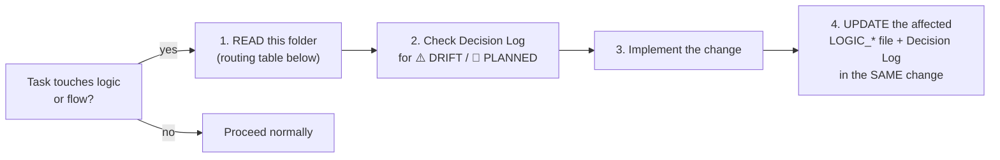

# Business Logic Index — The Canonical Logic Home

> **TL;DR:** This folder is the **single canonical home for business logic** across BE, FE, and
> DevOps. **Mandate: every time Claude Code wants to change any logic or flow, it MUST consult
> this folder first AND update it as part of the same change.** Shared rule definitions live in
> [../02_spec/BUSINESS_RULES.md](../02_spec/BUSINESS_RULES.md) (one fact, one home) — the LOGIC_*
> files here own the **per-layer interpretation and invariants** plus the owner's Decision Log.

---

## The Mandate (non-negotiable)

1. **Consult first** — before changing any rule, state transition, permission, payment behaviour,
   cache trigger, realtime event, or flow step: read the matching section in
   [LOGIC_BE.md](LOGIC_BE.md) / [LOGIC_FE.md](LOGIC_FE.md) / [LOGIC_DEVOPS.md](LOGIC_DEVOPS.md),
   plus the shared rule in [BUSINESS_RULES.md](../02_spec/BUSINESS_RULES.md) and the relevant
   `01_flow/` doc.
2. **Update in the same change** — if the change alters logic, the LOGIC_* file and this
   Decision Log must be updated before the task is DONE. A logic change without a doc update
   here is an incomplete task.
3. **Code wins on disagreement** — when a LOGIC_* file and the code disagree, the code is the
   fact; fix the file and record the discrepancy as a ⚠️ DRIFT entry in the Decision Log.

---

## Status Markers

| Marker | Meaning |
|---|---|
| ✅ implemented | Rule is in code and matches this doc |
| 🔮 PLANNED | Owner decision exists; **not in code yet** — do not assume endpoints/pages exist |
| ⚠️ DRIFT | Owner's target rule differs from current code behaviour — both are documented |

---

## How to Use This Folder

| File | Owns |
|---|---|
| [LOGIC_INDEX.md](LOGIC_INDEX.md) (this file) | Mandate, routing table, Decision Log |
| [LOGIC_BE.md](LOGIC_BE.md) | Server-side invariants: state machine, cancel, payments, RBAC, JWT, cache, realtime publishing |
| [LOGIC_FE.md](LOGIC_FE.md) | Client-side invariants: state homes, order write path, error mapping, cancel UX, redirects, reconnect, role routing |
| [LOGIC_DEVOPS.md](LOGIC_DEVOPS.md) | Infra-coupled logic: ports, proxy/SSE requirements, Redis roles, migration sequence, env, webhooks, backup/rollback |

Shared rule text (RBAC tables, cancel formula, payment rules, JWT config, realtime config) lives
**only** in [../02_spec/BUSINESS_RULES.md](../02_spec/BUSINESS_RULES.md). LOGIC_* files link to it
and add the layer-specific interpretation — never duplicate the full rule text.

---

## Routing Table — "I'm changing X, what must I read?"

| Changing… | LOGIC section | Shared rule | Flow doc |
|---|---|---|---|
| Order status transitions | [LOGIC_BE §2](LOGIC_BE.md#2--order-state-machine-enforcement) + [LOGIC_FE §6](LOGIC_FE.md#6--one-active-order--redirect-rules) | [BUSINESS_RULES §2](../02_spec/BUSINESS_RULES.md#2-order-rules) | [ORDER_STATE_MACHINE](../01_flow/ORDER_STATE_MACHINE.md) |
| Cancel rule / cancel UX | [LOGIC_BE §3](LOGIC_BE.md#3--cancel-rule--drift) + [LOGIC_FE §5](LOGIC_FE.md#5--cancel-ux--drift) | [BUSINESS_RULES §3](../02_spec/BUSINESS_RULES.md#3-cancel-rules) | [ORDER_STATE_MACHINE — cancel](../01_flow/ORDER_STATE_MACHINE.md#cancel-rules) |
| Order create / items / combos | [LOGIC_BE §4–5](LOGIC_BE.md#4--one-active-order-per-table) + [LOGIC_FE §2](LOGIC_FE.md#2--single-order-write-path) | [BUSINESS_RULES §2.3–2.5](../02_spec/BUSINESS_RULES.md#2-order-rules) | [CLIENT_FLOW](../01_flow/CLIENT_FLOW.md) |
| Payment / webhooks | [LOGIC_BE §6](LOGIC_BE.md#6--payment-rules) + [LOGIC_DEVOPS §6](LOGIC_DEVOPS.md#6--webhook-exposure) | [BUSINESS_RULES §4](../02_spec/BUSINESS_RULES.md#4-payment-rules) | [PAYMENT_FLOW](../01_flow/PAYMENT_FLOW.md) |
| RBAC / permissions | [LOGIC_BE §7](LOGIC_BE.md#7--rbac-middleware-rules) + [LOGIC_FE §8](LOGIC_FE.md#8--role--screen-routing) | [BUSINESS_RULES §1](../02_spec/BUSINESS_RULES.md#1-rbac-role-hierarchy) | [STAFF_FLOW](../01_flow/STAFF_FLOW.md) |
| Auth / JWT / guest token | [LOGIC_BE §8](LOGIC_BE.md#8--jwt--guest-token-rules) + [LOGIC_FE §1](LOGIC_FE.md#1--state-homes-strict) | [BUSINESS_RULES §5](../02_spec/BUSINESS_RULES.md#5-jwt--auth-rules) | [CLIENT_FLOW](../01_flow/CLIENT_FLOW.md) / [STAFF_FLOW](../01_flow/STAFF_FLOW.md) |
| Caching / invalidation | [LOGIC_BE §9](LOGIC_BE.md#9--cache-invalidation-triggers) + [LOGIC_DEVOPS §4](LOGIC_DEVOPS.md#4--redis-roles) | — | [REDIS_CACHE](../03_be/REDIS_CACHE.md) |
| Realtime events (SSE/WS) | [LOGIC_BE §10](LOGIC_BE.md#10--realtime-event-publishing-duties) + [LOGIC_FE §7](LOGIC_FE.md#7--ssews-reconnect-behaviours) + [LOGIC_DEVOPS §3](LOGIC_DEVOPS.md#3--caddy-proxy--ssews-requirements) | [BUSINESS_RULES §6](../02_spec/BUSINESS_RULES.md#6-realtime-config) | [REALTIME_SSE](../03_be/REALTIME_SSE.md) |
| Error codes / messages | [LOGIC_FE §4](LOGIC_FE.md#4--error-code--message-mapping-duty) | [ERROR_SPEC](../02_spec/ERROR_SPEC.md) | — |
| Migrations / env / ports / deploy | [LOGIC_DEVOPS](LOGIC_DEVOPS.md) | — | — |
| New pages (Welcome, Storage, online ordering…) | [LOGIC_FE §9](LOGIC_FE.md#9--planned-pages--flows-) | Decision Log below | [../08_pages/PAGES_INDEX.md](../08_pages/PAGES_INDEX.md) |

---

## Decision Log

> Owner decisions, newest first. Every logic change must add or update a row here.
> ⚠️ DRIFT entries stay until the code matches the target; then they flip to ✅.

| Date | Decision | Status | Layer impact |
|---|---|---|---|
| 2026-06-12 | **Customers can cancel their meal/order at ANY time before payment completes.** Replaces the "< 30% served" customer cancel rule. Current BE code still enforces < 30% and blocks cancel at `ready` — BE change pending. | ⚠️ DRIFT | [LOGIC_BE §3](LOGIC_BE.md#3--cancel-rule--drift) · [LOGIC_FE §5](LOGIC_FE.md#5--cancel-ux--drift) |
| 2026-06-12 | **Customers can register/login and order food online from home** — not only via table QR scan. | 🔮 PLANNED | [LOGIC_BE §11](LOGIC_BE.md#11--planned-domains-) · [LOGIC_FE §9](LOGIC_FE.md#9--planned-pages--flows-) |
| 2026-06-12 | **POS cashier can log in / order on behalf of customers who have no phone.** | 🔮 PLANNED | [LOGIC_BE §11](LOGIC_BE.md#11--planned-domains-) · [LOGIC_FE §9](LOGIC_FE.md#9--planned-pages--flows-) |
| 2026-06-12 | **New pages:** Welcome (`/welcome`), Introduction (`/introduction`), Admin Storage (`/admin/storage` — ingredient/inventory management). | 🔮 PLANNED | [LOGIC_FE §9](LOGIC_FE.md#9--planned-pages--flows-) · [LOGIC_BE §11](LOGIC_BE.md#11--planned-domains-) |

---

## Related Reading (inside this handbook)

| Topic | File |
|---|---|
| Shared rule definitions (single home) | [../02_spec/BUSINESS_RULES.md](../02_spec/BUSINESS_RULES.md) |
| All flows + intersection map | [../01_flow/FLOW_INDEX.md](../01_flow/FLOW_INDEX.md) |
| Error codes | [../02_spec/ERROR_SPEC.md](../02_spec/ERROR_SPEC.md) |
| BE structure + route table | [../03_be/BE_CODE_SUMMARY.md](../03_be/BE_CODE_SUMMARY.md) |
| FE inventory (stores, hooks, components) | [../04_fe/FE_CODE_SUMMARY.md](../04_fe/FE_CODE_SUMMARY.md) |
| Page inventory + drawings | [../08_pages/PAGES_INDEX.md](../08_pages/PAGES_INDEX.md) |
