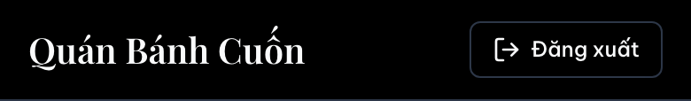
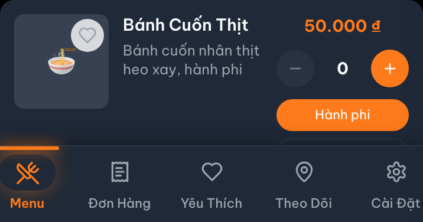
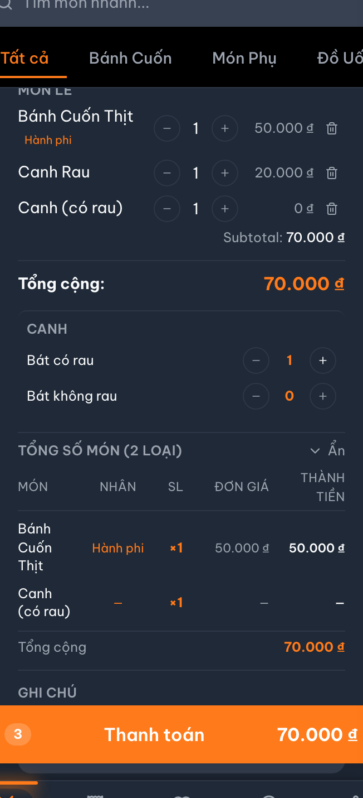
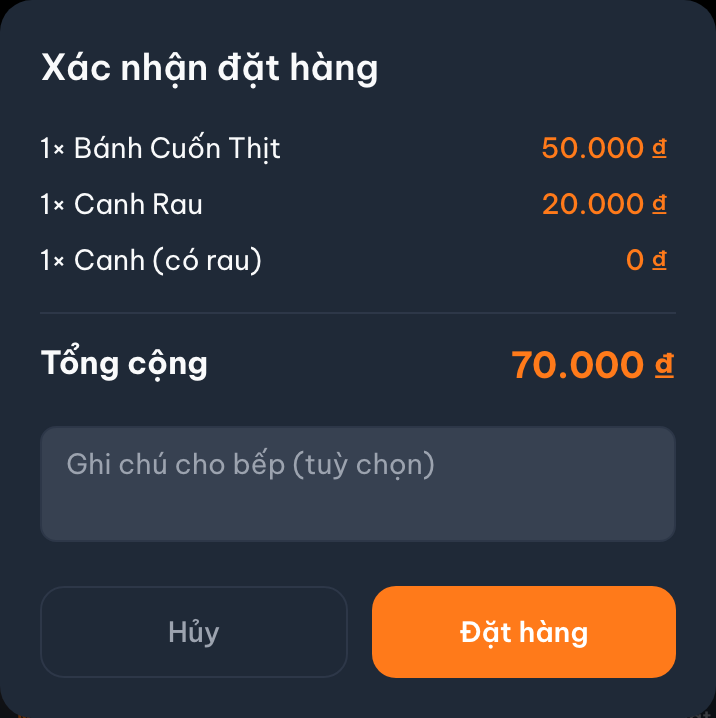

# Customer Menu — Mockup Trực Quan: Doc vs. Code vs. Đề Xuất Sửa + Feedback

> **Quy trình:** mỗi zone có **① Doc đang vẽ · ② Code render thật (ASCII) · ③ Đề xuất sửa**, kèm
> **📷 Ảnh chụp thật** và **💬 Feedback của bạn**. Bạn điền feedback vào ô đó → tôi chỉnh sửa theo.
>
> **Trạng thái ảnh chụp thật:** ✅ ĐÃ CHỤP (2026-06-20). Chụp từ app thật chạy qua `docker compose`
> (full stack), bằng Playwright (`e2e/tests/capture-menu-zones.spec.ts`), viewport iPhone 390×844, luồng
> QR thật (`/table/<token>` → `/menu`, tableId được set). Ảnh lưu ở `./screenshots/<zone>_real.png`.
> Toàn cảnh trang: [`screenshots/menu_full_real.png`](./screenshots/menu_full_real.png).
> Ngày: 2026-06-20. File này chỉ đọc — không sửa code/doc app.

---

## 🔴 Zone A — MenuHeader

Nguồn code: `MenuHeader.tsx:11,28-43`

### ① Doc đang vẽ (`customer_menu.md:14-15, 84`)
```
┌────────────────────────────────────────────────┐
│ Quán Bánh Cuốn                       Bàn 03    │  ◀── ⚡ useCartStore.tableName
└────────────────────────────────────────────────┘
```

### ② Code render THẬT
```
┌────────────────────────────────────────────────┐
│ Quán Bánh Cuốn                  ┌────────────┐  │  ◀── useSettingsStore().tableLabel
│ Bàn 03   ← subtitle (xám, nhỏ)  │ ⎆ Đăng nhập │  │      (KHÔNG phải cart.tableName)
│                                 └────────────┘  │  ◀── nút từ useAuthStore (đăng nhập/đăng xuất)
└────────────────────────────────────────────────┘
   • tableLabel nằm DƯỚI tên quán (subtitle), không nằm bên phải
   • Có user → "⎆ Đăng xuất" · chưa có → "⎆ Đăng nhập"
   • ⚠ tableLabel đến từ settings store; QR scan ghi cart.tableName → KHÔNG hiện ở đây
```

### ③ Đề xuất sửa doc (vẽ lại đúng + ghi rõ lỗi nguồn)
```
┌────────────────────────────────────────────────┐
│ Quán Bánh Cuốn                   [⎆ Đăng nhập] │  ◀── nút auth (useAuthStore)
│ Bàn 03  (subtitle)                              │  ◀── useSettingsStore.tableLabel
└────────────────────────────────────────────────┘
   FLAG 🔴: QR scan ghi cart.tableName nhưng header đọc settings.tableLabel
            → sau khi quét QR nhãn bàn có thể TRỐNG (lỗi code, cần sửa riêng)
```

| 📷 Ảnh chụp thật | 💬 Feedback của bạn |
|---|---|
| <br>⚠ **Bằng chứng:** nhãn bàn "Bàn 01" KHÔNG xuất hiện dù đã vào qua QR — đúng lỗi 🔴 (header đọc `settings.tableLabel` rỗng). Bên phải là nút "⎆ Đăng xuất". |  |

---

## 🔴 Zone F — ProductCard (chọn nhân)

Nguồn code: `ProductCard.tsx:104-148` · `ToppingModal.tsx` = 0 import (chết)

### ① Doc đang vẽ (`customer_menu.md:152-170`)
```
┌──────────────────────────────────┐
│ [img] Bánh cuốn thịt  35.000đ [+]│ ──▶ mở ▢ ToppingModal
└──────────────────────────────────┘
        │
        ▼
   ┌─ Chọn nhân ──────────────┐
   │ ☑ nhân thịt  ☐ nhân mọc  │   ← modal overlay
   │           [ Thêm vào giỏ] │
   └──────────────────────────┘
```

### ② Code render THẬT — KHÔNG có modal, pill inline trên thẻ
```
┌─────────────────────────────────────────────┐
│ [img]  Bánh cuốn               35.000đ       │
│        mô tả ngắn...        ┌───┐      ┌───┐  │
│                            │ – │  2   │ + │  │  ◀── stepper SL ngay trên thẻ
│                            └───┘      └───┘  │
│                            ( nhân thịt  )    │  ◀── pill nhân (single-select)
│                            ( nhân mộc nhĩ)   │      tô cam khi chọn
└─────────────────────────────────────────────┘
   • Không có ToppingModal nào được mở (file đó 0 import → code chết)
   • Nhân = pill data-driven từ product.toppings (ProductCard.tsx:131-147)
```

### ③ Đề xuất sửa doc
```
┌─────────────────────────────────────────────┐
│ [img]  Bánh cuốn        35.000đ  [–] n [+]   │
│        mô tả...         ( nhân thịt )(mộc nhĩ)│  ◀── pill inline, single-select
└─────────────────────────────────────────────┘
   • Bỏ khối "▢ ToppingModal" khỏi luồng E/F.
   • Ghi: ToppingModal.tsx là CODE CHẾT (0 import) → xoá ở task dọn code.
```

| 📷 Ảnh chụp thật | 💬 Feedback của bạn |
|---|---|
| <br>⚠ **Bằng chứng:** pill nhân "Hành phi" + stepper `[–] 0 [+]` ngay trên thẻ, KHÔNG có ToppingModal. |  |

---

## 🔴 Zone I — OrderSummary

Nguồn code: `OrderSummary.tsx:140-309`

### ① Doc đang vẽ (`customer_menu.md:176-181`)
```
┌──────────────────────────────────────┐
│ Đơn của bạn (preview)                 │
│ Ghi chú đơn: [______________]         │
└──────────────────────────────────────┘   rung 🔴 nếu thiếu canh
```

### ② Code render THẬT — phức tạp hơn nhiều, thu gọn được
```
┌─ Tóm tắt đơn hàng        [Bàn 03]   ⌄ Ẩn ─┐  ◀── header bấm để thu/mở (collapse)
│                                            │
│ COMBO                       Σ 42.000đ      │  ◀── nhóm, mỗi món có [–] n [+] 🗑
│   Combo Đầy Đặn   [–] 1 [+]  🗑   ⌄        │      combo mở rộng xem món con
│ MÓN LẺ                      Σ 35.000đ      │
│   Bánh cuốn thịt  [–] 1 [+]  🗑            │
│ ─────────────────────────────             │
│ Tổng cộng:                  77.000đ        │
│ ┌─ CANH ───────────────────────────────┐  │  ◀── viền chạy 🔴 nếu thiếu canh
│ │ ⚠ Bạn chưa chọn canh...               │  │
│ │ Bát có rau      [–] 0 [+]             │  │  ◀── stepper canh (ghi canh_* item)
│ │ Bát không rau   [–] 0 [+]             │  │
│ └──────────────────────────────────────┘  │
│ Tổng số món (2 loại)            ⌄ Hiện     │  ◀── bảng tổng hợp thu gọn được
│   Món          Nhân  SL  Đơn giá Thành tiền│
│   Bánh cuốn    thịt  ×1  35.000đ  35.000đ  │
│ ─────────────────────────────             │
│ Ghi chú            ✓ Đã lưu                │  ◀── lưu có debounce, hiện "Đã lưu"
│ [____________________________]            │
└────────────────────────────────────────────┘
```

### ③ Đề xuất sửa doc
> Thay ASCII 1 dòng bằng bản ②: nêu rõ 5 phần — (a) header collapse, (b) nhóm COMBO/MÓN LẺ có
> stepper+xoá, (c) **khu CANH có stepper + viền chạy khi thiếu**, (d) bảng **"Tổng số món"** thu gọn,
> (e) ghi chú có trạng thái "Đã lưu". OrderSummary **luôn render** (ngoài nhánh error/loading của page).

| 📷 Ảnh chụp thật | 💬 Feedback của bạn |
|---|---|
| <br>⚠ **Bằng chứng:** nhóm MÓN LẺ có stepper+xoá, khu **CANH** (Bát có rau/không rau), bảng **TỔNG SỐ MÓN (2 loại)** với cột Món/Nhân/SL/Đơn giá/Thành tiền — đúng như đề xuất ③. |  |

---

## 🔴 TableConfirmModal (luồng QR)

Nguồn code: `TableConfirmModal.tsx:48-101`

### ① Doc đang vẽ (`customer_menu.md:206-210`)
```
┌─ Xác nhận đơn Bàn 03 ────────────────┐
│ 3 món · 105.000đ                      │
│        [Hủy]   [Xác nhận gọi món]    │
└──────────────────────────────────────┘
   confirm ──▶ POST /orders
   201 ⇒ setActiveOrderId(id) → clearCart() → router.replace('/order/<id>')
```

### ② Code render + hành vi THẬT
```
┌─ Xác nhận đặt hàng ──────────────────┐   ◀── tiêu đề: "Xác nhận đặt hàng" (không có "Bàn 03")
│ 2× Bánh cuốn thịt          70.000đ    │
│ 1× Canh mọc                10.000đ    │
│ ─────────────────────────────        │
│ Tổng cộng                  80.000đ    │
│ ┌──────────────────────────────────┐ │   ◀── textarea ghi chú (LOCAL state, không phải store.orderNote)
│ │ Ghi chú cho bếp (tuỳ chọn)       │ │
│ └──────────────────────────────────┘ │
│      [ Hủy ]      [ Đặt hàng ]       │   ◀── nút: "Đặt hàng" (đang gửi → "Đang đặt...")
└──────────────────────────────────────┘
   201 ⇒ (lưu order_cache_<id>) → clearCart() → router.replace('/order/<id>')
   ❌ KHÔNG gọi setActiveOrderId — clearCart() reset activeOrderId về null
```

### ③ Đề xuất sửa doc
```
┌─ Xác nhận đặt hàng ──────────────────┐
│ <list món>            <tiền>          │
│ Tổng cộng             <tổng>          │
│ [ Ghi chú cho bếp (tuỳ chọn) ]       │  ← note CỤC BỘ, không đọc store.orderNote
│      [ Hủy ]      [ Đặt hàng ]       │
└──────────────────────────────────────┘
   201 ⇒ ① lưu order_cache_<id> → ② clearCart() → ③ router.replace('/order/<id>')
   FLAG 🔴: BỎ "setActiveOrderId(id)" — nó KHÔNG được gọi ở đây.
            activeOrderId chỉ được set sau, khi bấm "Theo dõi" ở /order/<id>.
```

| 📷 Ảnh chụp thật | 💬 Feedback của bạn |
|---|---|
| <br>⚠ **Bằng chứng:** tiêu đề "Xác nhận đặt hàng" (không có "Bàn 03"), có textarea "Ghi chú cho bếp (tuỳ chọn)", nút "Hủy" / "Đặt hàng" (không phải "Xác nhận gọi món"). |  |

---

## Tổng hợp việc cần làm (từ các mockup trên)

| Zone | Sửa doc | Sửa code (đăng ký MASTER trước) |
|---|---|---|
| MenuHeader | Vẽ lại: nút auth phải, tableLabel subtitle | 🔴 Đồng bộ tableName↔tableLabel (nhãn bàn trống sau QR) |
| ProductCard | Bỏ ToppingModal, vẽ pill inline | 🔴 Xoá `ToppingModal.tsx` chết |
| OrderSummary | Thay ASCII 1 dòng bằng bản đầy đủ | — |
| TableConfirmModal | Sửa tiêu đề/nút, thêm note, bỏ `setActiveOrderId` | — |

> Theo `CLAUDE.md`: phần sửa doc gộp 1 task; mỗi sửa code phải có dòng trong `MASTER_TASK.md` trước.
> Muốn ảnh chụp THẬT (Playwright) thì cần bật lại MCP + `docker compose up -d --build fe`, tôi sẽ chụp
> `/menu` và `/table/<id>` cho từng zone.
